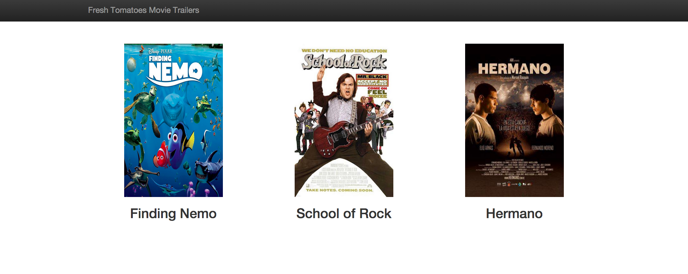
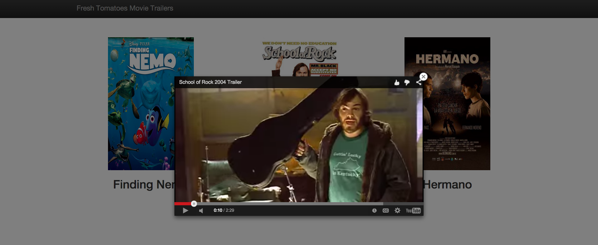

# P1-Movie-Trailer-Website
This is project one as the part of full stack web developer nanodegree at [Udacity](https://www.udacity.com/course/nd004).
I will write **server-side code** to store a list of my favorite movies, including:
* box art imagery
* movie trailer URL
I will then serve this data as a web page allowing visitors to review their movies and watch the trailers.

# Why this Project?

At their core, Full Stack Web Developers are programmers - we just happen to specialize in writing applications for the web! In this project, we’ll write your first application that is accessible via a web browser.

# What will I Learn?

I will learn how to write an application using object-oriented Python. You will then learn how to make this application serve HTML via a web server.

# How does this Help my Career?

* I will establish a foundation in core programming concepts using Python
* I  will understand the role a simple web server has in receiving a request, executing a block of code and generating a response

# Steps to complete this project?

1. Install [Python](https://www.python.org/)
2. Create a data structure (i.e. a Python Class) to store your favorite movies, including movie title, box art URL (or poster URL) and a YouTube link to the movie trailer.
3. Create multiple instances of that Python Class to represent your favorite movies; group all the instances together in a list.
4. To help you generate a website that displays these movies, we have provided a Python module called fresh_tomatoes.py - this module has a function called open_movies_page that takes in one argument, which is a list of movies and creates an HTML file which visualizes all of your favorite movies.
5. Ensure your website renders correctly when you attempt to load it in a browser.

*Final uploading time : May 2015*
